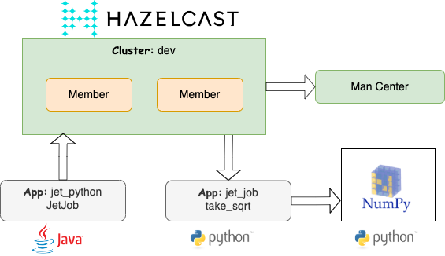
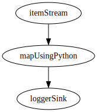

 [*PadoGrid*](https://github.com/padogrid) | [*Catalogs*](https://github.com/padogrid/catalog-bundles/blob/master/all-catalog.md) | [*Manual*](https://github.com/padogrid/padogrid/wiki) | [*FAQ*](https://github.com/padogrid/padogrid/wiki/faq) | [*Releases*](https://github.com/padogrid/padogrid/releases) | [*Templates*](https://github.com/padogrid/padogrid/wiki/Using-Bundle-Templates) | [*Pods*](https://github.com/padogrid/padogrid/wiki/Understanding-Padogrid-Pods) | [*Kubernetes*](https://github.com/padogrid/padogrid/wiki/Kubernetes) | [*Docker*](https://github.com/padogrid/padogrid/wiki/Docker) | [*Apps*](https://github.com/padogrid/padogrid/wiki/Apps) | [*Quick Start*](https://github.com/padogrid/padogrid/wiki/Quick-Start)

---

# Hazelcast Job: Executing Remote Python Code 

This bundle walks through the Hazelcast Jet job preparation, submission, and deubgging steps in detail and provides troubleshooting tips.

## Installing Bundle

```bash
install_bundle -download bundle-hazelcast-5-tutorial-app-jet_python
```

## Use Case

Applying a Python function to a Jet pipeline may look simple, but configuring and troubleshooting the job submission environment can quickly get complicated. If your environment is not setup properly, you will be left with Hazelcast's cryptic and generic exceptions that will offset you with hours of troublshooting time. This bundle walks through the job preparation, submission, and deubgging steps in detail and provides troubleshooting tips.



## Required Software

- Python 3.5+
- Java 11+
- Hazelcast 5.x (Full distribution of OSS or Enterprise. Slim distributions do not include Python binaries.)

## Bundle Contents

```console
apps
└── jet_python
    ├── bin_sh
    │   ├── build_app
    │   └── setenv.sh
    ├── pom.xml
    ├── requirements.txt
    └── src
        └── main
            ├── java
            │   └── org
            │       └── example
            │           └── JetJob.java
            └── python
                ├── requirements.txt
                └── take_sqrt.py
```

## Configuring Bundle Environment

1. Build app. The `build_app` script compiles the Java source code and creates a job jar file to be submitted to Hazelcast Jet.

```bash
cd_app jet_python/bin_sh
./build_app
```

2. Create Hazelcast cluster

The default cluster, `myhz`, is assumed throughout this tutorial.

```bash
make_cluster -product hazelcast
```

3. Setup Python Environment

If you will be debugging Python code, setup your Python environment with the provided `requirements.txt` file. Make sure your Python version is 3.5+.

```bash
cd_app jet_python
pip install -r requirements.txt
```

## Startup Sequence

Open two (2) terminals.

### 1. Start cluster

 Terminal 1

```bash
switch_cluster myhz
start_cluster
show_log -all
```

### 2. Submit job

 Terminal 2

```bash
cd_app jet_python
export PYTHONPATH=`pwd`/src/main/python
hz-cli -t dev@localhost:5701 submit target/jet-python-1.0.0.jar
```

If your environment has properly been setup, then you should see log messages in Terminal 1 as follows.

```console
2023-07-25 13:52:08 INFO  WriteLoggerP:263 - [padomac.local]:5701 [dev] [5.3.1] [python-function/loggerSink#1] sqrt(1051) = 32.42
2023-07-25 13:52:09 INFO  WriteLoggerP:263 - [padomac.local]:5701 [dev] [5.3.1] [python-function/loggerSink#1] sqrt(1052) = 32.43
...
```

**DAG:**

```console
digraph DAG {
	"itemStream" [localParallelism=1];
	"mapUsingPython" [localParallelism=1];
	"loggerSink" [localParallelism=1];
	"itemStream" -> "mapUsingPython" [queueSize=1024];
	"mapUsingPython" -> "loggerSink" [queueSize=1024];
}
```



---

## Example Job

[`JetJob.java`](apps/jet_python/src/main/java/org/example/JetJob.java) and [`take_sqrt.py`](apps/jet_python/src/main/python/take_sqrt.py) are the same code extracted from the [Hazelcast documentation](https://docs.hazelcast.com/hazelcast/latest/pipelines/python). `JetJob` creates a pipeline that periodically invokes `take_sqrt`.

There are two (2) `requirements.txt` files for installing the required Python modules as follows.

```console
jet_python
├── requirements.txt
└── src
    └── main
        └── python
            └── requirements.txt
```

[`jet_python/requirements.txt`](apps/jet_python/requirements.txt) is for your local Python environment and [`jet_python/src/main/python/requirements.txt`](apps/jet_python/src/main/python/requirements.txt) is for the job you will be submitting to Jet. The former includes the `hazelcast-python` module and the latter excludes it since Jet already has it installed.

---

## Monitoring Java and Python Processes

Use `top` to monitor `java` and `python` processes as follows.

macOS:

```bash
top -pid $(pgrep -d " " "java|python" |sed "s/ / -pid /g")
```

Linux:

```bash
top -p $(pgrep -d " " "java|python" |sed "s/ / -p /g")
```

## Setting Up the Job Submission Environment

1. Create a directory where you will keep code. Let's call it the job directory.
1. From the job directory:
   1. Place Java code in `src/main/java`
   1. Place Python code in `src/main/python`
   1. Create `pom.xml` that builds a runnable jar file with the job that you will be submitting.
   1. From VS Code, add `debugpy` in the Python code for remote debugging. See [Configuring VS Code for Remote Debugging](#configuring-vs-code-for-remote-debugging) for details.
1. Run `mvn package` to build the jar file.
1. Set `export PYTHONPATH=<job_directory>/src/main/python`.
1. **Before you start the cluster, make sure that you don't have any conflicting jars in the workspace `lib` and `plugins` directories.** You can clean up these directories as follows.

```bash
cd_workspace
rm -r lib/* plugins/*
```
1. Start cluster.
1. Submit the jar file.

```bash
mvn package
export PYTHONPATH=<job_directory>/src/main/python
hz-cli -t dev@localhost:5701 submit target/tutorial-python-1.0-SNAPSHOT.jar
```

---

## Debugging Jobs that Invoke Python Functions

This section walks through the steps involved in submitting  a Jet job that applies a Python function.

1. Compile Java code and generate a jar file.

```bash
switch_cluster myhz
mvn package
```

2. Submit job (jar file)

```bash
switch_cluster myhz
export PYTHONPATH=`pwd`/src/main/python
hz-cli -t dev@localhost:5701 submit target/tutorial-python-1.0-SNAPSHOT.jar
```

3. Upon successful job submission, check the running processes.

```bash
ps -ef | grep jet_to_python_grpc_server  | grep -v grep
```

Output:

```console
 501 71958 71662   0  1:04PM ttys008    0:10.18 python3 jet_to_python_grpc_server.py 61624 take_sqrt transform_list
```            

4. Using the `grpc` server PPID (parent PID), find the member (parent) that has started and is connected to it.

```bash
ps -ef | grep 71662 | grep -v grep
```

Output:

```console
  501 71662     1   0  1:03PM ttys008    1:12.40 /Library/Java/JavaVirtualMachines/jdk-17.0.3.1.jdk/Contents/Home/bin/java -server -Dpado.vm.id=myhz-padomac.local-02 -Dhazelcast.instance.name=myhz-padomac.local-02 -Dpadogrid.workspace=bundle-hazelcast-5-app-ml_lstm-cluster-ml_jet -Dpadogrid.rwe=rwe-bundles -Dhazelcast.config=/Users/dpark/Padogrid/workspaces/rwe-bundles/bundle-hazelcast-5-app-ml_lstm-cluster-ml_jet/clusters/myhz/etc/hazelcast.xml -Djet.custom.lib.dir=/Users/dpark/Padogrid/products/hazelcast-enterprise-5.3.1/custom-lib -Dhazelcast-addon.cluster-name=myhz -Dhazelcast-addon.group=myhz -Dhazelcast-addon.tcp.port=5702 -Dhazelcast-addon.tcp.members=padomac.local:5701,padomac.local:5702,padomac.local:5703,padomac.local:5704,padomac.local:5705,padomac.local:5706,padomac.local:5707,padomac.local:5708,padomac.local:5709,padomac.local:5710,padomac.local:5711,padomac.local:5712,padomac.local:5713,padomac.local:5714,padomac.local:5715,padomac.local:5716,padomac.local:5717,padomac.local:5718,padomac.local:5719,padomac.local:5720 -Dhazelcast-addon.management-center=http://localhost:8080/hazelcast-mancenter -Dhazelcast.logging.type=log4j2 -Dlog4j.configurationFile=/Users/dpark/Padogrid/workspaces/rwe-bundles/bundle-hazelcast-5-app-ml_lstm-cluster-ml_jet/clusters/myhz/etc/log4j2.properties -Dhazelcast.shutdownhook.enabled=true -Dhazelcast.shutdownhook.policy=GRACEFUL -Dcom.sun.management.jmxremote.port=12202 -Dcom.sun.management.jmxremote.ssl=false -Dcom.sun.management.jmxremote.authenticate=false -Dhazelcast.jmx=true -Xms1g -Xmx1g -Xdebug -agentlib:jdwp=transport=dt_socket,server=y,suspend=n,address=*:9402 -javaagent:/Users/dpark/Padogrid/products/padogrid_0.9.27-SNAPSHOT/lib/jmx_prometheus_javaagent-0.17.2.jar=8292:/Users/dpark/Padogrid/workspaces/rwe-bundles/bundle-hazelcast-5-app-ml_lstm-cluster-ml_jet/clusters/myhz/etc/prometheus.yml --add-modules java.se --add-exports java.base/jdk.internal.ref=ALL-UNNAMED --add-opens java.base/java.lang=ALL-UNNAMED --add-opens java.base/java.nio=ALL-UNNAMED --add-opens java.base/sun.nio.ch=ALL-UNNAMED --add-opens java.management/sun.management=ALL-UNNAMED --add-opens jdk.management/com.sun.management.internal=ALL-UNNAMED com.hazelcast.core.server.HazelcastMemberStarter
  501 71958 71662   0  1:04PM ttys008    0:12.32 python3 jet_to_python_grpc_server.py 61624 take_sqrt transform_list
```

From the output, we see that `jet_to_python_grpc_server.py` provides a `grpc` service for invoking the Python `take_sqrt` function by Member #2 (`myhz-padomac.local-02`).

5. List jobs

```bash
hz-cli -t dev@localhost:5701 list-jobs
```

Output:

```console
ID                  STATUS             SUBMISSION TIME         NAME
0a29-9c7c-a140-0001 RUNNING            2023-07-14T13:32:57.410 python-function
```

6. Cancel job.

✏️  Hit the tab key after `cancel` to auto-complete the job ID.

```bash
hz-cli -t dev@localhost:5701 cancel 0a29-9c7c-a140-0001
```

Output:

```console
Cancelling job id=0a29-9c7c-a140-0001, name=python-function, submissionTime=2023-07-14T13:32:57.410
Job cancelled.
```

7. Check `grpc` server

```bash
ps -ef | grep jet_to_python_grpc_server  | grep -v grep
```

There should not be `jet_to_python_grpc_server` running. The job cancellation should have stopped the `grpc` server.

8. The log file should also show that the job has been terminated.

```
show_log -num 2 -full
```

Output:

```console
...
2023-07-14 13:35:14 INFO  MasterJobContext:263 - [padomac.local]:5702 [dev] [5.3.1] Execution of job 'python-function', execution 0a29-9c7c-b1c0-0001 got terminated, reason=com.hazelcast.jet.impl.exception.CancellationByUserException
	Start time: 2023-07-14T13:32:57.411
	Duration: 00:02:17.186
	To see additional job metrics enable JobConfig.storeMetricsAfterJobCompletion
2023-07-14 13:35:14 WARN  JoinSubmittedJobOperation:263 - [padomac.local]:5702 [dev] [5.3.1] null
com.hazelcast.jet.impl.exception.CancellationByUserException: null
	at com.hazelcast.jet.impl.MasterJobContext.createCancellationException(MasterJobContext.java:211) ~[hazelcast-enterprise-5.3.1.jar:5.3.1]
	at com.hazelcast.jet.impl.MasterJobContext.getErrorFromResponses(MasterJobContext.java:626) ~[hazelcast-enterprise-5.3.1.jar:5.3.1]
	at com.hazelcast.jet.impl.MasterJobContext.lambda$invokeStartExecution$12(MasterJobContext.java:576) ~[hazelcast-enterprise-5.3.1.jar:5.3.1]
	at com.hazelcast.jet.impl.MasterContext.lambda$invokeOnParticipant$3(MasterContext.java:376) ~[hazelcast-enterprise-5.3.1.jar:5.3.1]
	at com.hazelcast.jet.impl.util.ExceptionUtil.lambda$withTryCatch$0(ExceptionUtil.java:182) ~[hazelcast-enterprise-5.3.1.jar:5.3.1]
	at com.hazelcast.spi.impl.AbstractInvocationFuture$WhenCompleteNode.lambda$execute$0(AbstractInvocationFuture.java:1570) ~[hazelcast-enterprise-5.3.1.jar:5.3.1]
	at java.util.concurrent.ForkJoinTask$RunnableExecuteAction.exec(ForkJoinTask.java:1395) ~[?:?]
	at java.util.concurrent.ForkJoinTask.doExec(ForkJoinTask.java:373) ~[?:?]
	at java.util.concurrent.ForkJoinPool$WorkQueue.topLevelExec(ForkJoinPool.java:1182) ~[?:?]
	at java.util.concurrent.ForkJoinPool.scan(ForkJoinPool.java:1655) ~[?:?]
	at java.util.concurrent.ForkJoinPool.runWorker(ForkJoinPool.java:1622) ~[?:?]
	at java.util.concurrent.ForkJoinWorkerThread.run(ForkJoinWorkerThread.java:165) ~[?:?]
...
```

---

## Finding Python Code when the Job Fails to Start

When a job is submitted, Hazelcast uploads Python code to each member's temporary directory. If Hazelcast encounters a problem while deploying a job, it will periodically retry the deployment. In that case, you can find the temporay directory path, by executing `ps` as follows.

```bash
ps -ef | grep python
```

Output:

You will see many instances of `clang`. One of them is shown below.

  501 86675 86674   0  8:27AM ttys008    0:00.14 /Library/Developer/CommandLineTools/usr/bin/clang -cc1 -triple x86_64-apple-macosx10.10.0 -Wundef-prefix=TARGET_OS_ -Wdeprecated-objc-isa-usage -Werror=deprecated-objc-isa-usage -Werror=implicit-function-declaration -emit-obj --mrelax-relocations -disable-free -disable-llvm-verifier -discard-value-names -main-file-name accesslog.upb.c -mrelocation-model pic -pic-level 2 -mframe-pointer=all -fno-strict-return -fno-rounding-math -munwind-tables -faligned-alloc-unavailable -target-sdk-version=12.3 -fvisibility-inlines-hidden-static-local-var -target-cpu core2 -tune-cpu generic -debugger-tuning=lldb -target-linker-version 763 -resource-dir /Library/Developer/CommandLineTools/usr/lib/clang/13.1.6 -isystem /Users/dpark/opt/anaconda3/envs/tensorflow311/include -isystem /Users/dpark/opt/anaconda3/envs/tensorflow311/include -isysroot /Library/Developer/CommandLineTools/SDKs/MacOSX.sdk -D NDEBUG -D _WIN32_WINNT=1536 -D GRPC_XDS_USER_AGENT_NAME_SUFFIX="Python" -D GRPC_XDS_USER_AGENT_VERSION_SUFFIX="1.48.0" -D GPR_BACKWARDS_COMPATIBILITY_MODE=1 -D HAVE_CONFIG_H=1 -D GRPC_ENABLE_FORK_SUPPORT=1 -D PyMODINIT_FUNC=extern "C" __attribute__((visibility ("default"))) PyObject* -D GRPC_POSIX_FORK_ALLOW_PTHREAD_ATFORK=1 -I src/python/grpcio -I include -I . -I third_party/abseil-cpp -I third_party/address_sorting/include -I third_party/cares/cares/include -I third_party/cares -I third_party/cares/cares -I third_party/cares/config_darwin -I third_party/re2 -I third_party/boringssl-with-bazel/src/include -I third_party/upb -I src/core/ext/upb-generated -I src/core/ext/upbdefs-generated -I third_party/xxhash -I third_party/zlib -I **/private/var/folders/h7/nxp6q55522381qnkpfxzfy6r0000gn/T/jet-modest_swartz-0a2a-9d98-05c0-0001-_Users_dpark_Padogrid_workspaces16107577374840456758/jet_to_python_env/include** -I /Users/dpark/opt/anaconda3/envs/tensorflow311/include/python3.11 -D HAVE_UNISTD_H -I/usr/local/include -internal-isystem /Library/Developer/CommandLineTools/SDKs/MacOSX.sdk/usr/local/include -internal-isystem /Library/Developer/CommandLineTools/usr/lib/clang/13.1.6/include -internal-externc-isystem /Library/Developer/CommandLineTools/SDKs/MacOSX.sdk/usr/include -internal-externc-isystem /Library/Developer/CommandLineTools/usr/include -O2 -Wall -Wno-reorder-init-list -Wno-implicit-int-float-conversion -Wno-c99-designator -Wno-final-dtor-non-final-class -Wno-extra-semi-stmt -Wno-misleading-indentation -Wno-quoted-include-in-framework-header -Wno-implicit-fallthrough -Wno-enum-enum-conversion -Wno-enum-float-conversion -Wno-elaborated-enum-base -Wno-reserved-identifier -Wno-gnu-folding-constant -Wno-objc-load-method -fdebug-compilation-dir=/private/var/folders/h7/nxp6q55522381qnkpfxzfy6r0000gn/T/pip-install-ntf_knbp/grpcio_5f30f578a7b542e191ef1d30a9fefe9d -ferror-limit 19 -fvisibility hidden -pthread -stack-protector 1 -mdarwin-stkchk-strong-link -fblocks -fencode-extended-block-signature -fregister-global-dtors-with-atexit -fgnuc-version=4.2.1 -fmax-type-align=16 -fcommon -vectorize-loops -vectorize-slp -clang-vendor-feature=+messageToSelfInClassMethodIdReturnType -clang-vendor-feature=+disableInferNewAvailabilityFromInit -clang-vendor-feature=+disableNonDependentMemberExprInCurrentInstantiation -fno-odr-hash-protocols -clang-vendor-feature=+enableAggressiveVLAFolding -clang-vendor-feature=+revert09abecef7bbf -clang-vendor-feature=+thisNoAlignAttr -clang-vendor-feature=+thisNoNullAttr -mllvm -disable-aligned-alloc-awareness=1 -D__GCC_HAVE_DWARF2_CFI_ASM=1 -o python_build/temp.macosx-10.10-x86_64-cpython-311/src/core/ext/upb-generated/envoy/config/accesslog/v3/accesslog.upb.o -x c src/core/ext/upb-generated/envoy/config/accesslog/v3/accesslog.upb.c

The temporary directory in bold font extracted from the above output shows the following.

```bash
tree -L 2 /private/var/folders/h7/nxp6q55522381qnkpfxzfy6r0000gn/T/jet-modest_swartz-0a2a-9d98-05c0-0001-_Users_dpark_Padogrid_workspaces16107577374840456758
```

Output:

```console
/private/var/folders/h7/nxp6q55522381qnkpfxzfy6r0000gn/T/jet-modest_swartz-0a2a-9d98-05c0-0001-_Users_dpark_Padogrid_workspaces16107577374840456758/
├── jet_to_python_cleanup.sh
├── jet_to_python_env
│   ├── bin
│   ├── include
│   ├── lib
│   └── pyvenv.cfg
├── jet_to_python_grpc_server.py
├── jet_to_python_init.sh
├── jet_to_python_main.sh
├── jet_to_python_params.sh
├── jet_to_python_pb2.py
├── jet_to_python_pb2_grpc.py
├── requirements.txt
└── take_sqrt.py
```

Hazelcast deploys the above scripts and your Python code to each member for each job you submit. You can browse the scripts to see how Hazelcast starts the `grpc` service.

## Finding Python Code when the Job Successfully Starts

The previous section showed how to find the temporary directory where the job is deployed in case when the job is struggling to start. If the job starts properly, then you may not be able to capture the `clang` instances in time before they complete. In that case, you can simply dump the working directory path in the Python code as follows.

```python
import os
import logging

# For our example, we place the log file in the PadoGrid workspace.

# PADOGRID_WORKSPACE is the directory path of the PadoGrid workspace where
# you submit the job. 
workspace_dir = os.environ['PADOGRID_WORKSPACE']

# Your application directory path. Let's set it to this bundle's app directory.
app_dir = workspace_dir + "/apps/jet_python"

# Create logger
logger = logging.getLogger('jet_python')
ch = logging.FileHandler(filename=app_dir + '/log/jet_python.log', encoding='utf-8')
logger.addHandler(ch)

# Log working directory.
logger.info(f'Python working directory: {os.getcwd()}')
```

---

## Configuring VS Code for Remote Debugging

We can remotely step through Python code by attaching VS Code to the `debugpy` server.

1. From VS Code, select *Run & Debug*. 
2. Select "create a launch.json file".
3. Enter the following in `launch.json`

```json
{
    "version": "0.2.0",
    "configurations": [
        {
            "name": "Python: Remote Attach",
            "type": "python",
            "request": "attach",
            "connect": {
                "host": "localhost",
                "port": 5678
            },
            "pathMappings": [
                {
                    "localRoot": "${workspaceFolder}/src/main/python",
                    "remoteRoot": "."
                }
            ],
            "justMyCode": true
        },
        {
            "name": "Python: Current File",
            "type": "python",
            "request": "launch",
            "program": "${file}",
            "console": "integratedTerminal",
            "justMyCode": true
        }
    ]
}
```

4. Add the following in Python code.

```python
import debugpy

is_debug_initialized = False

def transform_list(input_list):
    global is_debug_initialized
    if is_debug_initialized == False:
        debugpy.listen(("localhost", 5678))
        is_debug_initialized = True
...
```

5. Submit job.
6. Check the member log files to verity the job is running.
7. From VS Code, select *Python: Remote Attach* from *Run & Debug*.
8. Set break points in the Python code. If you see the message, "Breakpoint in file that does not exist", when you hover the breakpoints, then make sure "localRoot" is set to the correct Python code path in the `launch.json` file.

---

## Checking Debugger

You can check if the `debugpy` server is running by executing `lsof` as follows.

```bash
watch lsof -i:5678
```

Output:

`rrac` is port number 5678. The following shows the `debugpy` server is listening on 5678 and there are two connections: inbound and outbound.

```console
COMMAND     PID  USER   FD   TYPE             DEVICE SIZE/OFF NODE NAME
Code\x20H 31807 dpark   43u  IPv4 0x60bb89c7a3ffb3e3      0t0  TCP localhost:55753->localhost:rrac (ESTABLISHED)
python3.9 38197 dpark    3u  IPv4 0x60bb89c7a83dc3e3      0t0  TCP localhost:rrac (LISTEN)
python3.9 38197 dpark    8u  IPv4 0x60bb89c7a7789923      0t0  TCP localhost:rrac->localhost:55753 (ESTABLISHED)
```

---

## Troubleshooting Jet Issues

At times, you may encoutner error messages similar to the following.

```console
2023-07-17 10:30:49 ERROR JoinSubmittedJobOperation:263 - [padomac.local]:5701 [dev] [5.3.1] PythonService initialization failed: java.lang.Exception: Initialization script finished with non-zero exit code: 1
com.hazelcast.jet.JetException: PythonService initialization failed: java.lang.Exception: Initialization script finished with non-zero exit code: 1
```

The above message is typically followed by warning messages as shown below as Hazelcast repeatedly attempts to intialize PythonService.

```console
2023-07-17 10:34:38 WARN  ProcessorSupplierWithService:263 - [padomac.local]:5701 [ml_jet] [5.3.1] [python-function/mapUsingPython#PS] PythonService context creation failed, will retry
com.hazelcast.jet.JetException: PythonService initialization failed: java.lang.Exception: Initialization script finished with non-zero exit code: 1
```

Unfortunately, the error message stops short of providing additional information that can help us to find the root cause.

Compounding the problem, cancelling the job that has a "PythonService initialization failed" error can take several minutes to complete as shown in the example below.

### Job Cancellation Example

```bash
hz-cli -t ml_jet@localhost:5701 cancel 0a2d-4eda-98c0-0001
```

Output: A job with a "PythonService intialization failed" error may get stuck with the following message for a very long time.

```console
Cancelling job id=0a2d-4eda-98c0-0001, name=python-function, submissionTime=2023-07-17T10:27:42.099
```

Output: After several minutes, the job cancellation finally completes with the following message.

```console
Cancelling job id=0a2d-4eda-98c0-0001, name=python-function, submissionTime=2023-07-17T10:27:42.099
Job cancelled.
```

The member log files will eventually shows the following exception.

```console
2023-07-17 10:42:00 INFO  MasterJobContext:263 - [padomac.local]:5701 [ml_jet] [5.3.1] Execution of job 'python-function', execution 0a2d-4eda-ec80-0001 got terminated, reason=com.hazelcast.jet.impl.exception.CancellationByUserException
Start time: 2023-07-17T10:27:42.109
	Duration: 00:14:18.340
    To see additional job metrics enable JobConfig.storeMetricsAfterJobCompletion
2023-07-17 10:42:00 WARN  JoinSubmittedJobOperation:263 - [padomac.local]:5701 [ml_jet] [5.3.1] null
com.hazelcast.jet.impl.exception.CancellationByUserException: null
	at com.hazelcast.jet.impl.MasterJobContext.createCancellationException(MasterJobContext.java:211) ~[hazelcast-enterprise-5.3.1.jar:5.3.1]
	at com.hazelcast.jet.impl.MasterJobContext.getErrorFromResponses(MasterJobContext.java:626) ~[hazelcast-enterprise-5.3.1.jar:5.3.1]
    ...
```

The cancellation request was submitted right after the "PythonService intialization failed" message was reported in the log file. As you can see from the warning message, it took over 14 minutes to cancel the job.

If you see the following message in the member log files, then it is likely that your pipeline code is using the wrong instance of Hazelcast. In that case, the error messages described above may occur.

```console
...
2023-07-17 09:58:38 INFO  HazelcastBootstrap:69 - Bootstrapped instance requested but application wasn't called from hazelcast submit script. Creating a standalone Hazelcast instance instead. Jet is enabled in this standalone instance.
...
```

Make sure to pass in `ctx -> ctx.hazelcastInstance()` to `SinkBuilder`.

```java
static class MySinks {
    static Sink<Object> build() {
        return SinkBuilder.sinkBuilder("My Sink", ctx -> ctx.hazelcastInstance())
                .receiveFn((hazelcastInstance, item) -> {
                ...
```

---

## References

1. Python debugging in VS Code, <https://code.visualstudio.com/docs/python/debugging>
2. `debugpy` - a debugger for Python, <https://github.com/microsoft/debugpy>
3. Installing and Running VS Code in PadoGrid, <https://github.com/padogrid/padogrid/wiki/VS-Code>
4. Apply a Custom Transform with Python, Hazelcast, <https://docs.hazelcast.com/hazelcast/latest/pipelines/python>
